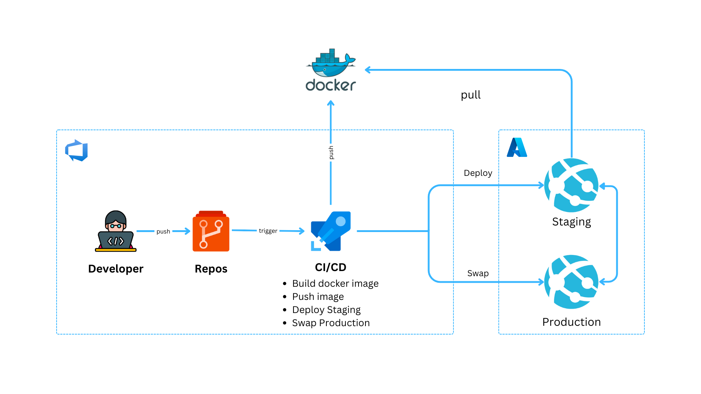

## .NET 7 Web API hosted in Azure DevOps
### Overview
This is a sample .NET 7 application hosted in Azure DevOps, with a Docker containerization strategy, and two Azure Pipeline configurations. The first pipeline is a CI/CD pipeline that builds and pushes the Docker image to Docker Hub, deploys a new image to App Service to the Staging environment with the built Docker image, and gives the ability to swap the Staging environment to the Production App Service environment. The second pipeline is a provisioning pipeline that provisions an Azure Resource Group that contains an Azure App Service with a Linux Container type that has two slots: Staging and Production, using Terraform.

### Infrastrcuture

### Prerequisites
Azure DevOps Account
Docker Hub Account
Docker Desktop
Azure Subscription
Terraform

### Setup
Clone this repository.
Open the folder using Visual Studio Code or Visual Studio 2022 or later. 
Build the solution to ensure that it compiles without errors.
Update the Dockerfile with your application-specific configurations.
Commit and push your changes to repository.

### Azure Pipeline Configurations
##### CI/CD Pipeline
CI/CD pipeline located in the azure-pipelines/ci-cd.yml file in the root directory of this repository. The pipeline performs the following steps:

Builds the Docker image of the application.
Pushes the built image to Docker Hub.
Deploys the application to the Staging environment of the Azure App Service.
Enables the Swap deployment feature in the App Service, allowing you to swap the Staging environment with the Production environment.
To use this pipeline, you need to navigate Pipelines section in sidebar Azure DevOps. This pipeline runs automatically when there is a new change in master branch in api project

When you run it to build and deploy the application to the Staging environment. Once the deployment is complete, you can swap the Staging environment with the Production environment using the Production Stage of the pipeline or you can swap it using Azure Portal or the Azure CLI.

##### Provisioning Pipeline
Provisioning Pipeline located in the provisioning.yml file in the azure-pipelines directory of this repository. The pipeline performs the following steps:

Uses Terraform to provision an Azure Resource Group.
Creates an Azure App Service with a Linux Container type that has two slots: Staging and Production.

### Why Azure App Service for hosting? 
Azure App Service is a platform as a service (PaaS) offering from Microsoft Azure that allows you to easily deploy and manage web applications, including containerized applications.
There are several benefits to using Azure App Service for hosting your containerized ASP.NET Web API:
- Easy deployment and management: With Azure App Service, you can quickly deploy your containerized application to the cloud without having to worry about infrastructure management.
- High availability: Azure App Service provides built-in load balancing and auto-scaling capabilities, which ensure that your application is highly available and can handle high traffic loads.
- Security: Azure App Service provides a secure environment for your application, with features such as SSL/TLS encryption and integration with Azure Active Directory.
- Integration with other Azure services: Azure App Service can easily integrate with other Azure services, such as Azure DevOps, Azure Monitor, and Azure Application Insights, to provide a complete end-to-end solution for your application.
- Cost-effective: Azure App Service offers a pay-as-you-go pricing model, which allows you to only pay for what you use, making it a cost-effective solution for hosting your containerized application.

In summary, Azure App Service provides a robust and scalable platform for hosting your containerized ASP.NET Web API, allowing you to focus on building and deploying your application rather than worrying about infrastructure management.
